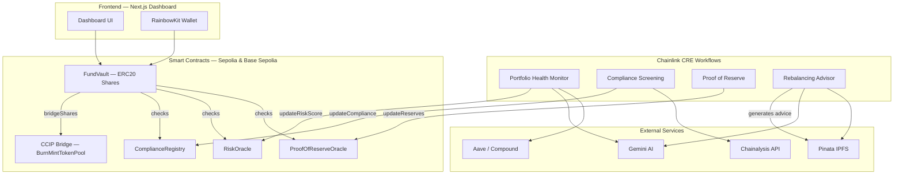

# 🏰 Watchtower — Institutional DeFi Risk Management

> **AI-powered, compliance-first vault management** built on Chainlink CRE.

---

## 📌 Overview

Watchtower is an institutional-grade DeFi risk management platform that uses **Chainlink Compute Runtime Environment (CRE)** workflows to continuously monitor, analyze, and act on vault risk in real time. It combines on-chain smart contracts with off-chain AI analysis to provide:

- **Automated portfolio health monitoring** with Gemini AI risk scoring
- **Compliance screening** via Chainalysis sanctions API
- **Proof of Reserve** verification using Chainlink PoR feeds
- **AI-powered rebalancing** recommendations with IPFS-pinned reports
- **Cross-chain share bridging** via Chainlink CCIP (Sepolia + Base Sepolia)
- **Real-time dashboard** with wallet connectivity

---

## 🏗️ Architecture



---

## 📁 Project Structure

```
watchtower/
├── smart-contracts/         # Foundry — Solidity contracts (deployed to Sepolia)
│   ├── src/core/            # ComplianceRegistry, RiskOracle, ProofOfReserveOracle, FundVault
│   ├── src/interfaces/      # Contract interfaces
│   ├── src/mock/            # MockUSDC
│   ├── script/              # Deployment scripts
│   ├── test/                # Foundry tests
│   └── deployments/         # Deployment addresses (Sepolia)
│
├── cre-workflow/            # Chainlink CRE TypeScript workflows
│   ├── portfolio-health-workflow/     # AI risk scoring (Gemini)
│   ├── compliance-screening-workflow/ # Chainalysis sanctions check
│   ├── proof-of-reserve-workflow/     # Reserve verification
│   ├── rebalancing-advisor-workflow/  # AI rebalancing recommendations
│   ├── contracts/                     # ABI bindings
│   └── shared/                        # Shared utilities
│
└── frontend/                # Next.js 16 dashboard
    ├── app/                 # App Router pages
    ├── components/          # Shadcn UI + custom components
    ├── hooks/               # React hooks
    └── lib/                 # Utilities & mock data
```

---

## 🚀 Quick Start

### Prerequisites

- **Node.js** ≥ 18
- **Foundry** ([install](https://book.getfoundry.sh/getting-started/installation))
- **Chainlink CRE CLI** (`npm i -g @chainlink/cre-cli`)

### 1. Smart Contracts

```bash
cd smart-contracts
forge install
forge build
forge test
```

Contracts are already deployed and verified on Sepolia — see [deployments/sepolia.md](smart-contracts/deployments/sepolia.md).

### 2. CRE Workflows

```bash
cd cre-workflow
cp .env.example .env
# Fill in API keys (Gemini, Chainalysis, Pinata)
```

See [LOCAL_DEVELOPMENT.md](cre-workflow/LOCAL_DEVELOPMENT.md) for detailed instructions.

### 3. Frontend

```bash
cd frontend
npm install
npm run dev
# Open http://localhost:3000
```

---

## Deployed Contracts

### Ethereum Sepolia

| Contract                 | Address           | Etherscan                                                                               |
| :----------------------- | :---------------- | :-------------------------------------------------------------------------------------- |
| **ComplianceRegistry**   | `0x1649...1c56`   | [View](https://sepolia.etherscan.io/address/0x164940bd662A21174dd5Db21AECc1Ae46d8b1c56) |
| **RiskOracle**           | `0x1723...28A7`   | [View](https://sepolia.etherscan.io/address/0x17238806EdDcF45c0e85eE3FC74ad7A2e4f128A7) |
| **ProofOfReserveOracle** | `0xcb66...d52`    | [View](https://sepolia.etherscan.io/address/0xcb66fe00e909E86Fb2F392DD0c2122E1ac7Eed52) |
| **FundVault**            | `0x27b2...6ED2`   | [View](https://sepolia.etherscan.io/address/0x27b2e0AF46B4E63749DF2Ef4325FDa82F9b86ED2) |
| **MockUSDC**             | `0x57a1...E4707D` | [View](https://sepolia.etherscan.io/address/0x57a1c6761Ccade88c5eA2735BfbAC0EA83E4707D) |
| **BurnMintTokenPool**    | `0xe733...86c3`   | [View](https://sepolia.etherscan.io/address/0xe733a69A7DdAD406a8F0585417c1fCE9644586c3) |

### Base Sepolia

| Contract                 | Address         | Etherscan                                                                               |
| :----------------------- | :-------------- | :-------------------------------------------------------------------------------------- |
| **ComplianceRegistry**   | `0xB14a...cFA0` | [View](https://sepolia.basescan.org/address/0xB14a5927b20927A8812AC060c00CBE17772CcFA0) |
| **RiskOracle**           | `0xe476...cf4B` | [View](https://sepolia.basescan.org/address/0xe47691F0188D8BD9013e1a5cCaF34baD0b37cf4B) |
| **ProofOfReserveOracle** | `0x892C...053c` | [View](https://sepolia.basescan.org/address/0x892C2C0eD81f80Ba727af29c7A128A4A2e9d053c) |
| **FundVault**            | `0x7857...858D` | [View](https://sepolia.basescan.org/address/0x785708dD1753fdEAc9C3d1aaC02f5c0cd3B1858D) |
| **MockUSDC**             | `0xe41e...2D8f` | [View](https://sepolia.basescan.org/address/0xe41e15b91Ae30f3cB4f0193c4ca1f00c82342D8f) |
| **BurnMintTokenPool**    | `0xAF4F...66Ad` | [View](https://sepolia.basescan.org/address/0xAF4Fc00dA34DED131E1868Ae97a6D56eEf8D66Ad) |

FundVault is registered as a native **Chainlink CCIP** burn/mint token on both chains, enabling cross-chain share transfers via `bridgeShares()`.

See [deployments/sepolia.md](smart-contracts/deployments/sepolia.md) for full details.

---

## 🔧 CRE Workflows

| Workflow                 | Purpose                                                                        | Frequency    | External APIs          |
| :----------------------- | :----------------------------------------------------------------------------- | :----------- | :--------------------- |
| **Portfolio Health**     | Reads on-chain holdings, scores risk via Gemini AI, updates `RiskOracle`       | Every 5 min  | Gemini, Aave, Compound |
| **Compliance Screening** | Checks addresses against sanctions lists, updates `ComplianceRegistry`         | On-demand    | Chainalysis            |
| **Proof of Reserve**     | Verifies vault reserves against custodian data, updates `ProofOfReserveOracle` | Every 15 min | Chainlink PoR Feeds    |
| **Rebalancing Advisor**  | Generates AI rebalancing advice, pins reports to IPFS                          | Every 1 hr   | Gemini, Pinata         |

---

## 🖥️ Frontend Pages

| Page             | Route          | Description                                         |
| :--------------- | :------------- | :-------------------------------------------------- |
| Dashboard        | `/`            | System health overview, risk gauge, recent alerts   |
| Portfolio Health | `/portfolio`   | Token breakdown, risk score history, AI analysis    |
| Compliance       | `/compliance`  | Address screening, sanctions results                |
| Proof of Reserve | `/reserves`    | Reserve ratios, collateral tracking                 |
| Rebalancing      | `/rebalancing` | AI recommendations, risk/return scatter, history    |
| Settings         | `/settings`    | Workflow schedules, API integrations, notifications |

---

## 🛡️ Security

- **Role-based access control** on all contracts (`CRE_WORKFLOW_ROLE`, `COMPLIANCE_OFFICER_ROLE`, `FUND_MANAGER_ROLE`)
- **Compliance-gated transfers** — every FundVault transfer checks KYC + sanctions status
- **Risk-aware deposits** — blocked when risk ≥ 85
- **Reserve safeguards** — operations blocked if under-collateralized (< 95%)
- **Cross-chain security** — CCIP burn/mint with BurnMintTokenPool, role-gated minting

---

## ⚙️ Tech Stack

| Layer           | Technology                                      |
| :-------------- | :---------------------------------------------- |
| Smart Contracts | Solidity, Foundry, OpenZeppelin, Chainlink CCIP |
| CRE Workflows   | TypeScript, Chainlink CRE CLI                   |
| AI/ML           | Google Gemini 2.5 Flash                         |
| Compliance      | Chainalysis Sanctions API                       |
| Storage         | Pinata (IPFS)                                   |
| Frontend        | Next.js 16, Tailwind CSS 4, Shadcn UI           |
| Web3            | Wagmi, Viem, RainbowKit                         |
| Charts          | Recharts                                        |

---

## 📄 License

MIT — see [LICENSE](LICENSE) for details.
