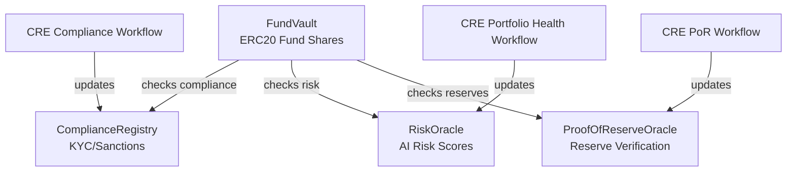

# Watchtower Smart Contracts

Institutional-grade Solidity contracts for the Watchtower DeFi risk management platform, built with Foundry and deployed on Ethereum Sepolia and Base Sepolia.

## 🏗️ Architecture

This directory contains four core contracts that work together to create a compliance-aware, AI-monitored tokenized fund:

### Core Contracts

#### 1. **ComplianceRegistry** (`src/core/ComplianceRegistry.sol`)

- Tracks KYC/AML status for all investors
- Maintains sanctions screening results
- Supports batch updates from CRE compliance workflow
- Role-based access: `COMPLIANCE_OFFICER_ROLE` and `CRE_WORKFLOW_ROLE`

#### 2. **RiskOracle** (`src/core/RiskOracle.sol`)

- Stores AI-generated risk scores (0-100)
- Monitors protocol health (Aave, Compound, etc.)
- Triggers auto-liquidation when risk ≥ 85
- Updated by CRE portfolio health workflow every 5 minutes

#### 3. **ProofOfReserveOracle** (`src/core/ProofOfReserveOracle.sol`)

- Verifies fund reserves using Chainlink PoR feeds
- Cross-checks with custodian API data
- Calculates reserve ratio in basis points
- Activates safeguards if reserves insufficient

#### 4. **FundVault** (`src/core/FundVault.sol`)

- Main ERC20 tokenized fund shares
- Integrates all three oracles for comprehensive checks
- Compliance-gated deposits, withdrawals, and transfers
- Risk-aware operations (blocks deposits if risk > 85)
- Reserve-aware (blocks operations if under-collateralized)
- **CCIP-native token** — registered as a Chainlink CCIP burn/mint token for cross-chain share transfers
- `bridgeShares()` sends shares cross-chain via CCIP Router
- `getBridgeFee()` estimates bridge costs for the frontend

### Contract Dependencies



## 📁 File Structure

```
src/
├── core/
│   ├── ComplianceRegistry.sol      # KYC/sanctions tracking
│   ├── RiskOracle.sol              # AI risk monitoring
│   ├── ProofOfReserveOracle.sol    # Reserve verification
│   └── FundVault.sol               # Main fund contract (CCIP-enabled)
├── interfaces/
│   ├── IComplianceRegistry.sol
│   ├── IRiskOracle.sol
│   ├── IProofOfReserveOracle.sol
│   ├── IFundVault.sol
│   └── IReceiverContracts.sol      # CRE receiver interface
├── mock/
│   ├── MockUSDC.sol                # Testing token (6 decimals)
│   ├── MockAavePool.sol            # Mock Aave lending pool
│   └── MockCompoundReserve.sol     # Mock Compound reserve
script/
├── DeployWatchtower.s.sol          # Full deployment script
└── RegisterFundVaultCCIP.s.sol     # CCIP registration (pool + admin + remote config)
```

## 🚀 Quick Start

### Prerequisites

- [Foundry](https://book.getfoundry.sh/getting-started/installation) installed
- Sepolia testnet RPC URL
- Private key with Sepolia ETH

### Installation

```bash
# Install dependencies
forge install

# Compile contracts
forge build

# Run tests (Phase 3)
forge test

# Deploy to Sepolia
forge script script/Deploy.s.sol --rpc-url $SEPOLIA_RPC_URL --broadcast
```

## 🔑 Access Control

Each contract implements role-based access control:

| Contract                 | Role                      | Purpose                    |
| ------------------------ | ------------------------- | -------------------------- |
| **ComplianceRegistry**   | `COMPLIANCE_OFFICER_ROLE` | Manual compliance updates  |
|                          | `CRE_WORKFLOW_ROLE`       | Batch updates from CRE     |
| **RiskOracle**           | `CRE_WORKFLOW_ROLE`       | Update risk scores         |
| **ProofOfReserveOracle** | `CRE_WORKFLOW_ROLE`       | Update reserve data        |
| **FundVault**            | `FUND_MANAGER_ROLE`       | Rebalancing, bridge shares |
|                          | `CRE_WORKFLOW_ROLE`       | Update total assets, bridge|
|                          | `MINTER_ROLE`             | Mint shares (CCIP pool)    |
|                          | `BURNER_ROLE`             | Burn shares (CCIP pool)    |
| **All**                  | `DEFAULT_ADMIN_ROLE`      | Pause/unpause, grant roles |

## 💡 Key Features

### Compliance Integration

Every transfer in `FundVault` checks:

- ✅ Sender has completed KYC
- ✅ Sender is not sanctioned
- ✅ Recipient has completed KYC
- ✅ Recipient is not sanctioned

### Risk-Aware Operations

- Deposits blocked when risk score ≥ 85
- Rebalancing blocked when risk score ≥ 90
- Auto-liquidation event triggered at threshold

### Reserve Safeguards

- Deposits blocked if reserves insufficient
- Reserve ratio must be ≥ 95% (configurable)
- Cross-verification between Chainlink PoR and custodian APIs

## 🧪 Testing

```bash
forge test
```

- Unit tests for each contract
- Integration tests for cross-contract interactions
- Fuzz testing for edge cases
- Gas optimization tests

## Deployed Contracts

### Ethereum Sepolia

| Contract                 | Address                                                                                                                |
| :----------------------- | :--------------------------------------------------------------------------------------------------------------------- |
| **ComplianceRegistry**   | [`0x1649...1c56`](https://sepolia.etherscan.io/address/0x164940bd662A21174dd5Db21AECc1Ae46d8b1c56)                     |
| **RiskOracle**           | [`0x1723...28A7`](https://sepolia.etherscan.io/address/0x17238806EdDcF45c0e85eE3FC74ad7A2e4f128A7)                     |
| **ProofOfReserveOracle** | [`0xcb66...d52`](https://sepolia.etherscan.io/address/0xcb66fe00e909E86Fb2F392DD0c2122E1ac7Eed52)                      |
| **FundVault**            | [`0x27b2...6ED2`](https://sepolia.etherscan.io/address/0x27b2e0AF46B4E63749DF2Ef4325FDa82F9b86ED2)                     |
| **MockUSDC**             | [`0x57a1...707D`](https://sepolia.etherscan.io/address/0x57a1c6761Ccade88c5eA2735BfbAC0EA83E4707D)                     |
| **BurnMintTokenPool**    | [`0xe733...86c3`](https://sepolia.etherscan.io/address/0xe733a69A7DdAD406a8F0585417c1fCE9644586c3)                     |

### Base Sepolia

| Contract                 | Address                                                                                                                |
| :----------------------- | :--------------------------------------------------------------------------------------------------------------------- |
| **ComplianceRegistry**   | [`0xB14a...cFA0`](https://sepolia.basescan.org/address/0xB14a5927b20927A8812AC060c00CBE17772CcFA0)                     |
| **RiskOracle**           | [`0xe476...cf4B`](https://sepolia.basescan.org/address/0xe47691F0188D8BD9013e1a5cCaF34baD0b37cf4B)                     |
| **ProofOfReserveOracle** | [`0x892C...053c`](https://sepolia.basescan.org/address/0x892C2C0eD81f80Ba727af29c7A128A4A2e9d053c)                     |
| **FundVault**            | [`0x7857...858D`](https://sepolia.basescan.org/address/0x785708dD1753fdEAc9C3d1aaC02f5c0cd3B1858D)                     |
| **MockUSDC**             | [`0xe41e...2D8f`](https://sepolia.basescan.org/address/0xe41e15b91Ae30f3cB4f0193c4ca1f00c82342D8f)                     |
| **BurnMintTokenPool**    | [`0xAF4F...66Ad`](https://sepolia.basescan.org/address/0xAF4Fc00dA34DED131E1868Ae97a6D56eEf8D66Ad)                     |

See [deployments/sepolia.md](deployments/sepolia.md) for full details.

## 📝 License

MIT License - see LICENSE file for details.

## 🔗 Related

- [Main Project README](../README.md)
- [CRE Workflows](../cre-workflow/README.md)
- [Frontend Dashboard](../frontend/README.md)
